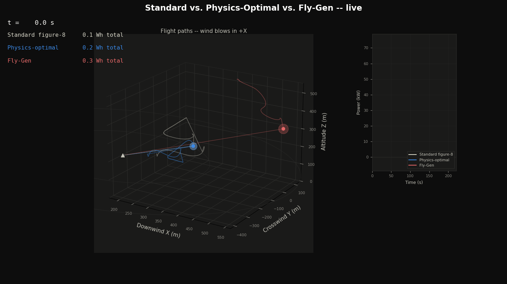
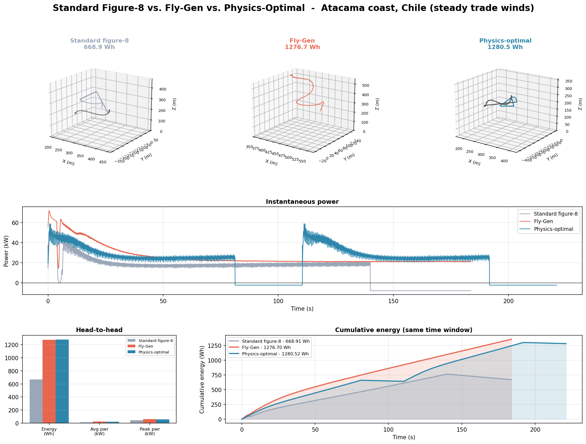

# AeroYield

Full 6DOF flight-dynamics simulation and physics-based flight-path optimization for airborne wind energy (AWE) kites. Given a wind site and a kite, it searches for the flight pattern that maximizes energy production, and compares the result against a standard, un-optimized figure-8.

*All three strategies flying live (`python kite_animate.py --compare`), same site, same clock: standard figure-8 (gray), physics-optimal Ground-Gen (blue, dims during its retraction phase), and Fly-Gen (red) -- glow size tracks instantaneous power, so the brightest marker is winning in real time.*

For a representative site (Atacama coast, 12 m/s trade wind, 50 kg / 20 m² kite), physics-optimal Ground-Gen produced roughly 99% more energy than the standard figure-8 pumping cycle over the same window, and edged out Fly-Gen too -- the search found a pumping cycle that beats both a fixed-shape winch strategy and a completely different power architecture. The static breakdown below has the exact numbers:

Run `python kite_compare.py` for a fresh comparison at any site -- the winner depends on wind speed, shear, and how aggressively each architecture can be optimized within its own steering-bandwidth limits.

## Background

Airborne wind energy replaces a conventional turbine's tower and blades with a tethered kite flying fast crosswind loops. A kite moving quickly across the wind generates a much stronger apparent wind than a stationary blade tip ever sees, the same principle that lets a sailboat sail faster than the true wind by tacking across it. Since power scales with the cube of wind speed, that speed advantage compounds into a large energy advantage.

Most commercial systems fly a standardized ascending figure-8 pattern. This project asks whether that shape is actually optimal, or whether a physics-based search can do better.

## Two power architectures

**Ground-Gen (pumping cycle).** The kite flies loops while the tether reels out under tension, spinning a generator on the ground. Once fully extended, the kite is pitched to kill lift and reeled back in cheaply, and the cycle repeats. This is the architecture most commercial companies (Kitepower, TwingTec, SkySails Power) fly.

**Fly-Gen (onboard generator).** The kite carries small turbines and generates power directly from the apparent wind rushing past it, with a fixed-length tether and no winch. This is the architecture Google's Makani project used before shutting down in 2020.

## Flight dynamics

The physics engine (`kite_dynamics.py`) is a full 6-degree-of-freedom rigid body: position, velocity, attitude quaternion, and body-frame angular velocity, integrated with fourth-order Runge-Kutta. Aerodynamic force and moment come from angle of attack and sideslip (computed from the kite's actual attitude, not assumed), with stall modeled as a smooth falloff past a critical angle. The tether attaches at a bridle point offset from the center of gravity, so a loaded tether creates a real restoring moment -- a bridled kite weathervaning toward the tether line, the same way a real one does.

Steering is a single control input (differential brake/line deflection) that produces a rolling moment; the kite's bank angle is something that *emerges* from rotational dynamics -- inertia, damping, a rise time -- rather than being kinematically snapped to a commanded value each step, the key difference from a simpler point-mass model. A cascaded guidance/control loop (proportional-navigation heading tracking, feeding a rate-damped steering command) flies the kite along a parametric figure-8 reference path.

## How it works

All code lives in [`codestack/`](codestack/).

**`kite_dynamics.py`**: the 6DOF physics engine described above, plus the wind/atmosphere model.

**`kite_flygen.py`**: Fly-Gen architecture -- guidance, steering control, and simulation on a fixed tether. Running it directly flies a reasonable, un-optimized figure-8.

**`kite_groundgen.py`**: Ground-Gen (pumping-cycle) architecture -- the power (reel-out) phase uses the same full 6DOF simulation with a lengthening tether; the retraction (reel-in) phase uses a quasi-steady closed-form model (Loyd, 1980) instead, since real systems fly that phase deliberately gentle and it isn't where the interesting physics or the optimization value is.

**`kite_path_optimizer.py`**: a generic global search (differential evolution) that works for *either* architecture -- point it at `kite_flygen.simulate` or `kite_groundgen.simulate` and it searches flight-path shape and winch/generator settings for whatever maximizes average power, subject to a tether-tension safety cap.

**`kite_environments.py`**: turns a location choice into concrete wind conditions, with a handful of named presets.

**`kite_compare.py`**: runs all three strategies (standard figure-8, physics-optimal Ground-Gen, Fly-Gen) for a given site and produces a written report and comparison plot.

**`kite_animate.py`**: renders a flight as a live 3D GIF -- flight path, a glowing marker/trail colored by instantaneous power, and a live power-vs-time readout. `--compare` runs all three `kite_compare.py` strategies together on one animated plot (that's the README hero image); without it, animates a single `--arch`.

## Validation

Two independent sanity checks against the literature, not just internal self-consistency:

- **Loyd's (1980) crosswind power limit.** The classic theoretical ceiling for crosswind kite power is P = (2/27)·ρ·A·C_L·(C_L/C_D)²·v_wind³ -- an idealized upper bound assuming lossless, continuously-optimal crosswind flight. This simulation's output stays under that ceiling in every case checked (as it must -- exceeding it would mean a bug), and lands at roughly **10-21% of the theoretical limit** at reference wind conditions. That's below the ~47% aerodynamic conversion efficiency reported for the largest published real AWE prototype, which is expected: Loyd's ceiling assumes the kite sustains ~130 m/s apparent airspeed for this glide ratio and wind speed, while this simulation's steering-bandwidth-limited flight paths (see below) top out around 15-35 m/s. Physically sensible, honestly short of what a more aggressively-tuned controller could reach.
- **Wind-speed / kite-size robustness sweep.** `DEFAULT_PARAMS` fly cleanly from **4-22 m/s** reference wind for Fly-Gen and **6-22 m/s** for Ground-Gen, and from 10-40 m² kite area for both (Ground-Gen tested robust to 80 m²). The low-wind cutoff used to be much narrower (~10-11 m/s for both) -- root-caused by direct instrumentation, not guessed: sustained hard-over steering was exciting a pitch/angle-of-attack oscillation that passive pitch stiffness couldn't damp fast enough at low wind, since that stiffness scales with wind speed² while the kite's pitch inertia doesn't (gain-scheduling the roll loop and slowing the figure-8's turn rate alone both measured zero effect, since neither touches the pitch axis). Fixed with an active angle-of-attack control loop (`kite_flygen.pitch_command`, dynamic-pressure gain-scheduled) plus shrinking the figure-8's own aggressiveness at low wind (`wind_shape_scale`), which together pushed both architectures' cut-in down to 4-6 m/s. Ground-Gen's cut-in stays a couple m/s above Fly-Gen's for a physical reason, not a tuning gap: it has to generate enough tension to both stay aloft *and* pay out tether against a loaded winch at the same time, a strictly harder energy balance than Fly-Gen's fixed-tether "just stay aloft." Ground-Gen also needed its own additional fix at the *high*-wind end: the same shape and gains that fly cleanly on Fly-Gen's fixed tether turned out to have less stability margin during Ground-Gen's growing-tether reel-out (confirmed by direct A/B testing -- the crash persisted with reeling speed and starting tether length independently varied, so it wasn't about the tether length or reel rate specifically), so `kite_groundgen.simulate` applies a flat 15% amplitude/frequency margin on top of the shared low-wind scaling.

## Known simplifications

- **Retraction fidelity.** As above, the reel-in phase of the pumping cycle uses quasi-steady theory rather than full 6DOF -- a deliberate fidelity trade, not an oversight, since that phase isn't where the flight-path optimization matters.
- **Steering and pitch bandwidth.** The guidance loop's roll authority and the active pitch/angle-of-attack loop both set practical limits on how tight/fast a figure-8 is trackable before the kite loses the pattern; `kite_flygen.PARAM_BOUNDS` and `kite_groundgen.PARAM_BOUNDS` are scoped to stay inside that envelope, and `wind_shape_scale` backs the figure-8 off further as wind drops (see Validation above).
- **Kite-size envelope is narrower than the wind-speed one.** At reference wind (12 m/s), `DEFAULT_PARAMS` for both architectures fly cleanly from 10-40 m²; below that (5 m², much lower pitch inertia for the same gains) both lose the pattern, and above 40 m² Fly-Gen specifically loses it too (Ground-Gen stays clean to 80 m²). Not chased further than identifying the boundary -- a size-dependent (not just wind-dependent) version of the gain scheduling above would be the fix, mirrored on inertia rather than dynamic pressure.
- **Aerodynamic/inertial coefficients** (stability derivatives, moments of inertia) are physically-motivated estimates for a low-aspect-ratio power kite, not fit to a specific real vehicle -- absolute force/tension magnitudes are order-of-magnitude plausible rather than validated against flight-test data, the same caveat the location presets in `kite_environments.py` already carry for wind conditions. Roll control authority specifically was tuned up partway through development to make the demo figure-8s trackable, rather than derived independently -- worth knowing if asked "why this value."
